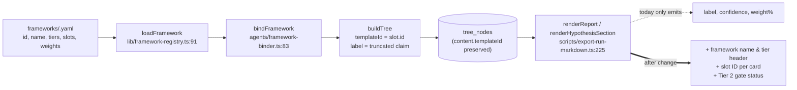

## Why

The framework's bones are right (5-slot Tier 1 attractiveness/winnability check + Tier 2 mode comparator gated at conf > 0.6) but two things are wrong:

1. **Label fragility** — `ge-9-box-with-make-buy-ally` is not actually a GE 9 Box; the name collapses the moment anyone scrutinizes it.
2. **Invisible structure** — the run export ([`scripts/export-run-markdown.ts`](scripts/export-run-markdown.ts)) emits zero framework metadata: no framework name, no tier label, no slot IDs, no Tier 2 gate status. A reader has no way to tell this isn't a free-form hypothesis tree (violates Non-Negotiable #1 in spirit).

Both are fixable as a rename + rendering change. No tree, weight, or rollup changes.

## Decisions baked in (please flag if wrong)

- **New slug:** `market-entry-tiered`
- **New `name`:** "Market Entry: Attractiveness → Winnability → Mode"
- **Rendering scope:** markdown export + the CaseView framework header. Hypothesis cards in [`components/KanbanBoard.tsx`](components/KanbanBoard.tsx) and [`components/HypothesisDrilldown.tsx`](components/HypothesisDrilldown.tsx) are deferred — the feedback was about the run output, and the UI cards are a separate surface.
- **Sequential-gate vs weighted-AND** is explicitly v2 and out of scope here.

## Architecture (current → after)



The data is already in the DB (`templateId` on `HypothesisContent`); we just need to re-load the framework YAML in the export and print fields the renderer already has access to.

## Work

### 1. Rename the framework files and references

- Rename [`frameworks/ge-9-box-with-make-buy-ally.yaml`](frameworks/ge-9-box-with-make-buy-ally.yaml) → `frameworks/market-entry-tiered.yaml`.
  - Change `id:` to `market-entry-tiered`.
  - Change `name:` to `Market Entry: Attractiveness → Winnability → Mode`.
  - Loader is filename-driven (`frameworks/${id}.yaml` at [`lib/framework-registry.ts:91`](lib/framework-registry.ts)), and asserts `parsed.id === id` — so the file rename and the `id` field must stay in sync.
- Rename [`frameworks/ge-9-box-with-make-buy-ally.query-templates.yaml`](frameworks/ge-9-box-with-make-buy-ally.query-templates.yaml) → `frameworks/market-entry-tiered.query-templates.yaml` (verify the loader path in `lib/query-builder.ts` and update if it references the old slug).
- [`cases/abb-rack-pdu.yaml`](cases/abb-rack-pdu.yaml) line 4: `frameworkId: market-entry-tiered`.
- [`agents/decision.ts`](agents/decision.ts) line 218 comment: update `Hard-coded for 'ge-9-box-with-make-buy-ally'` → new slug.
- [`agents/micky.ts`](agents/micky.ts) line 577: update the banned-term scrubber entry from `"ge-9-box-with-make-buy-ally"` to `"market-entry-tiered"` (and also keep the old slug for a release or two so historical Micky output gets scrubbed).
- [`scripts/smoke-micky-agent.ts`](scripts/smoke-micky-agent.ts): update test framework slug.
- Leave `legacy-claude/*.md` historical docs alone (they're archived planning notes).
- DB rows: any existing `cases.framework_id = 'ge-9-box-with-make-buy-ally'` will break on next load. Either update them via a one-shot migration script or document that prior runs are read-only after rename.

### 2. Surface the framework in the markdown export

All edits in [`scripts/export-run-markdown.ts`](scripts/export-run-markdown.ts):

- **Load the framework alongside the case** in `main` (around lines 38–77): pass `loadFramework(caseConfig.frameworkId)` into `renderReport` so the renderer has access to `framework.name`, `framework.tiers[0].name`, `framework.tiers[1]` (gate, options, criteria), and the `BoundSlot[]`.
- **Header line in `renderReport`** (after line 256, before `## Decision`):

  ```markdown
  **Framework:** Market Entry: Attractiveness → Winnability → Mode (`market-entry-tiered`) — Tier 1 of 2
  ```

- **Tier 2 gate status block** in the `## Decision` section (around line 268, after `**Weakest link:**`). Render *whether or not* it fired:
  - Fired: `**Tier 2 (Build / Buy / Partner):** activated at confidence 0.71 ≥ 0.60. Recommendation: BUY.`
  - Skipped: `**Tier 2 (Build / Buy / Partner):** not activated — Tier 1 confidence 0.458 < 0.60 gate.`
  - The gate constant lives at [`agents/decision.ts:24`](agents/decision.ts) (`TIER2_THRESHOLD = 0.6`); the `Tier2Result` is already on `DecisionContent.tier2`. We need to also persist (or re-derive) the rolled confidence on the decision node so the export can compare. The decision node's own `confidence` column already holds the rolled value, so no schema change is needed — just print it.
- **Per-hypothesis card** in `renderHypothesisSection` (around line 343–347): add a slot ID + tier line directly under the heading:

  ```markdown
  ### Accessible market in global data center market…
  
  **Slot:** `market-attractive` (Tier 1 · weight 25%)
  **Confidence:** 67.3% (0.673)
  **Status:** complete
  ```

  `templateId` is already on `node.content` (set at [`agents/tree-builder.ts:41`](agents/tree-builder.ts)); the displayLabel can be looked up from the loaded framework's slot list. Sub-hypotheses get the same treatment with the parent slot ID.

### 3. Surface the framework in the live CaseView header

Single-spot edit in [`components/CaseView.tsx`](components/CaseView.tsx) lines 194–199:

- Replace the bare slug `{config.frameworkId}` with `framework.name` (primary) and the slug as a small monospace subtitle.
- Show the tier list inline: `Tier 1: Should we pursue? · Tier 2: Build, buy, or partner? (gates at conf > 0.60)`.
- Requires loading the framework on the server side and passing `framework.name`, `framework.tiers[*].name`, and `framework.tiers[1].activatesIf` into the component as props (mirror the `loadFramework` call already used in [`agents/framework-binder.ts`](agents/framework-binder.ts)).

### 4. Sanity check + regenerate one run for visual diff

- Run `npm run typecheck`.
- Re-export the existing ABB run via `tsx scripts/export-run-markdown.ts abb-rack-pdu` (or whatever the script's CLI is) into a new file (e.g. `docs/abb-rack-pdu-run-<id>-renamed.md`) and visually diff against [`docs/abb-rack-pdu-run-f9a4c8c5.md`](docs/abb-rack-pdu-run-f9a4c8c5.md) to confirm the new framework header, slot IDs, and Tier 2 gate line appear.

## Explicitly NOT in this change (deferred to v2)

- Changing rollup from weighted-AND to sequential gate. Stays as is.
- Wiring `framework.tiers[1].activatesIf` as an actual evaluated expression (still hard-coded `0.6` in [`agents/decision.ts:24`](agents/decision.ts)).
- Wiring `framework.tiers[1].options` / `criteria` from YAML into [`agents/tier2-evaluator.ts`](agents/tier2-evaluator.ts) (currently hard-coded in the prompt at lines 54–74).
- Slot-ID badges on Kanban / Drilldown hypothesis cards.
- Renaming any prose in the SPEC / PLAN docs in `legacy-claude/`.

## Risk register

- **Filename rename breaks any DB row referencing the old slug** — pre-rename, write a single-line update script or just delete the dev case and reseed.
- **Banned-term scrubber in [`agents/micky.ts:577`](agents/micky.ts)** — keep the old slug in the list temporarily so legacy Micky output stays clean.
- **The `name` arrow character (→)** — already used in the proposed name string. Verify YAML parses cleanly (it should as plain UTF-8) and that the markdown renders. Fall back to `->` if any tool chokes.